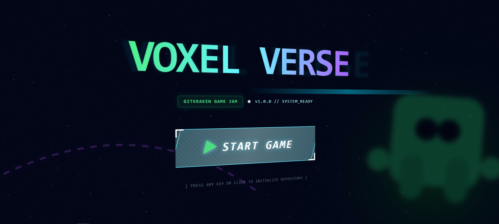
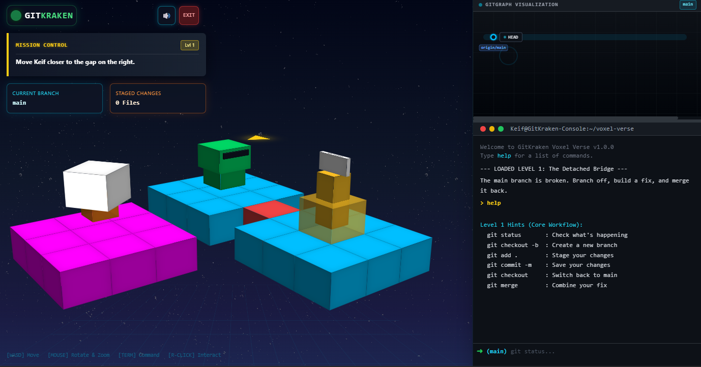
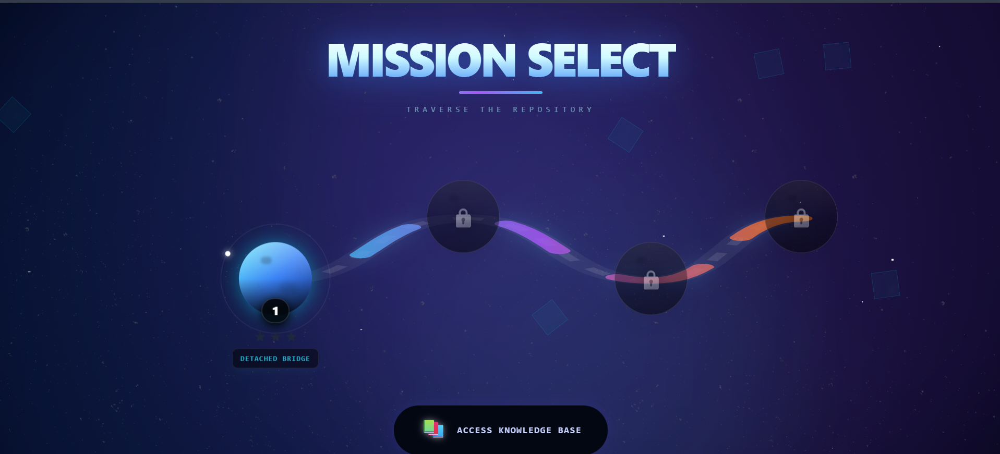
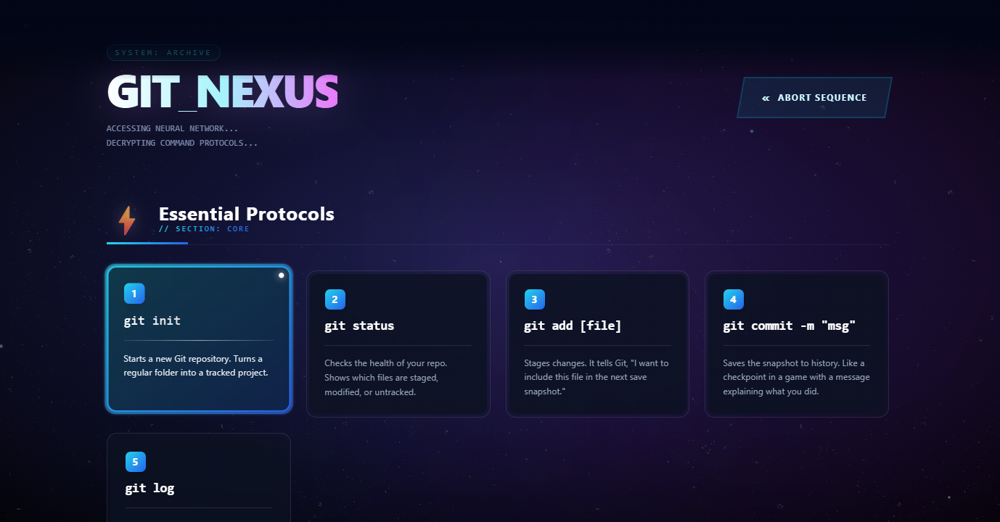

<div align="center">

# 🐙 GITKRAKEN: VOXEL VERSE

**THE FIRST 3D GAMIFIED GIT EXPERIENCE**

[](https://gitkraken.com)
[](https://reactjs.org/)
[](https://developer.mozilla.org/en-US/docs/Web/CSS/transform-style)
[](./LICENSE)

<br />

```text
                                   █▀▀ █ ▀▀█▀▀ █ █ █▀▀█ █▀▀█ █ █ █▀▀ █▀▀▄
                                   █ ▀ █   █   █▀▄ █▄▄▀ █▄▄█ █▀▄ █▀▀ █  █
                                   ▀▀▀ ▀   ▀   ▀ ▀ ▀ ▀▀ ▀  ▀ ▀ ▀ ▀▀▀ ▀  ▀

                                 V  O  X  E  L     V  E  R  S  E
```

<br />
</div>

> **"Imagine if Minecraft and GitKraken had a baby, and it taught you how to code."**  
> **A 3D Gamified Git Experience built for GitKon 2025 Game Jam.**
> Master version control mechanics in a visually stunning, synthwave-infused voxel world.

 

### itch.io published : [https://ksejal630.itch.io/gitkraken-voxel-verse]
### Live demo : [View Here](https://voxel-verse.netlify.app/)

---

## 🚀 Why Play Voxel Verse?

Git can be abstract, intimidating, and text-heavy. **Voxel Verse** changes the paradigm by turning the command line into a playground.

*   **Turn Confusion into Clarity:** "Rebasing" isn't just a command anymore—it's a tactile puzzle where you physically rearrange timeline blocks.
*   **See Your Impact:** Watch the **Real-time Holo-Graph** draw complex commit histories dynamically as you play.
*   **Audio-Reactive World:** Immerse yourself in a generative **Synthwave Soundtrack** that evolves as you solve puzzles.
*   **Zero-Setup Learning:** No terminal installation required. Just load the page and start committing.

Whether you're a student trying to understand `merge conflicts` or a senior dev looking for a chill lo-fi coding vibe, this game puts you in the flow state.

---

## 🎮 Game Overview

**GitKraken: Voxel Verse** puts you in control of **Keif the Kraken**, a digital avatar traversing the corrupted sectors of a code repository.

Instead of reading documentation, you *live* the workflow:
*   ⚔️ **Merge Conflicts** are physical barriers that must be dismantled.
*   ⏳ **Time Travel** is achieved by `checking out` previous commits.
*   🍒 **Teleportation** allows you to `cherry-pick` resources across dimensions.
*   🌌 **History Rewriting** lets you physically `swap` blocks to clean up a messy rebase.

---

## 🏗️ Under The Hood - ( Technical Architecture )

We built a game engine from scratch to win this.

### 🎨 The "No-Canvas" Voxel Engine (`VoxelEngine.tsx`)
A marvel of DOM manipulation. We don't use Three.js. We don't use Canvas.
*   **Pure CSS 3D Transforms:** Every block is a `div` with `preserve-3d`.
*   **Performance:** Optimized with React Memoization for silky smooth 60fps.
*   **Result:** Crisp, pixel-perfect edges that look great on any screen.

### 🧠 The Logic Kernel (`useGameLogic.ts`)
A complete Git emulation layer.
*   **Virtual File System:** Tracks staged files (`inventory`), commit history, and branch topology.
*   **CLI Parser:** Parses strings like `git checkout -b feature` and maps them to game actions.

### 🔊 Generative Audio (`useSound.ts`)
*   **Procedural Music:** The music is generated code-side.
*   **Lookahead Scheduler:** Ensures professional-grade timing precision for the beats.

### 🤖 Agentic Workflow
This project showcases the power of **Agentic AI**. 
*   **Architecture:** The component structure and state machines were drafted using Google Gemini.
*   **Optimization:** AI was used to refactor the Voxel Engine for 60fps performance on low-end devices.

---

## 🧩 Game Mechanics & Levels

### Level 1: The Detached Bridge
**Concept:** Branching & Merging  
The main path is broken. The player must:
1.  Create a new branch (`git checkout -b fix`).
2.  Walk to a resource block to stage it (`git add .`).
3.  Commit the fix (`git commit`).
4.  Merge it back to main (`git merge`) to solidify the bridge.

### Level 2: The Revert Realm
**Concept:** Undoing Changes  
A giant "Bug" obstacle blocks the path.
1.  Inspect history (`git log`) to find the bad commit hash.
2.  Use `git revert [hash]` to destroy the bug and clear the path.

### Level 3: The Cherry-Pick Chasm
**Concept:** Selective Merging  
The player needs a bridge block from a parallel "feature" timeline, but the feature branch is full of "Lava" (bugs).
1.  Identify the one good commit hash.
2.  Use `git cherry-pick [hash]` to teleport *only* that block to the main timeline.

### Level 4: Rebase Ridge
**Concept:** Interactive Rebase  
The timeline is physically scattered. Commits are floating in the wrong positions.
1.  Enter rebase mode (`git rebase -i`).
2.  Use the custom `swap` command to physically reorder the voxel blocks into the correct linear slots.

---

## 💻 Installation

Want to hack on the Voxel Verse? <br>
_here's your chance_

```bash
# 1. Clone the repo
git clone https://github.com/your-username/voxel-verse.git

# 2. Install dependencies
npm install

# 3. Enter the Verse
npm run dev
```


---

## 📸 Gallery

| **The Intro** | **The Game World** |
|:---:|:---:|
|  |  |
| *Cinematic 3D CSS Title* | *Isometric Voxel Engine* |

| **Mission Select** | **Knowledge Base** |
|:---:|:---:|
|  |  |
| *Cosmic Navigation* | *Interactive Documentation* |

---

## 🌟 Conclusion

**GitKraken: Voxel Verse** proves that developer tools don't have to be boring.
By visualizing abstract data structures as physical objects, -->  we make learning Git intuitive and rewarding. 

Whether you are a junior dev struggling with `rebase` or a senior dev who just wants to see a voxel Kraken spin, there is something here for you.


<div align="center">
  
**Built with 💜 by _SEJAL_KAMBLE_   for GitKon 2025 Game Jam**
</div>


